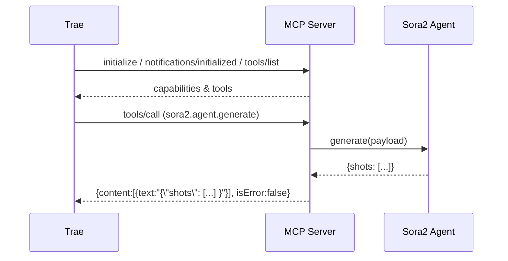

# Sora2 Prompt MCP Server

一个遵循 MCP（Model Context Protocol）标准的 stdin/stdout 服务器，提供中文剧本文本到 Sora2 指令（shots JSON）的解析工具 `sora2.agent.generate`。

- 主要功能：角色识别、O.S./VO 判定、摄影机与表演建议、台词抽取与排序。
- 适配 Trae：支持 `initialize`、`notifications/initialized`、`tools/list`、`tools/call` 四个 JSON-RPC 方法。

## 安装与环境
- 需要 Python 3.11+。
- Windows 11 建议设置环境变量：`PYTHONIOENCODING=utf-8`。

### Trae 配置（mcpServers）
将以下配置添加到 Trae 设置中：
```json
{
  "mcpServers": {
    "sora2": {
      "command": "python",
      "args": ["-m", "src.mcp_server"],
      "env": {
        "PYTHONIOENCODING": "utf-8",
        "PYTHONPATH": "e:\\User\\Documents\\GitHub\\sora prompt"
      }
    }
  }
}
```

## 使用方法

### JSON-RPC（推荐）
在 Trae MCP 面板依次发送：
```
{"jsonrpc":"2.0","id":1,"method":"initialize","params":{"protocolVersion":"2024-11-05","capabilities":{},"clientInfo":{"name":"Trae","version":"1.0"}}}
{"jsonrpc":"2.0","method":"notifications/initialized"}
{"jsonrpc":"2.0","id":2,"method":"tools/list"}
{"jsonrpc":"2.0","id":3,"method":"tools/call","params":{"name":"sora2.agent.generate","arguments":{"text":"示例文本","default_seconds":"4"}}}
```
返回 `tools/call.result.content[0].text` 为 JSON 字符串，包含 `shots` 数组。

### 一键处理示例文本
将 `tests/测试文稿.md` 处理并保存到 `tests/shots_测试文稿.json`：
```powershell
$t = Get-Content "tests/测试文稿.md" -Raw
Write-Output (@"{""jsonrpc"":""2.0"",""id"":3,""method"":""tools/call"",""params"":{""name"":""sora2.agent.generate"",""arguments"":{""text"":""$t"",""default_seconds"":""4""}}}@") | python -m src.mcp_server > tests/shots_测试文稿.json
```

### CLI（直接调用，不经 MCP）
```powershell
python -m src.sora2_agent --text_file tests/测试文稿.md --seconds 4 > tests/shots_测试文稿.json
```

## 目录结构
- `src/mcp_server.py`：MCP 服务器（stdin/stdout）。
- `src/mcp_tool.py`：工具入口，封装 `sora2_agent`。
- `src/sora2_agent.py`：核心解析逻辑（正则、候选人名、O.S./VO、摄影机/表演建议）。
- `docs/MCP.md`：协议与使用说明。
- `docs/DEVELOPMENT.md`：开发文档（架构、扩展、测试）。
- `docs/QUICKSTART.md`：5 分钟快速上手。
- `tests/`：示例与用例。

## 常见问题
- PowerShell 中直接管道中文到 JSON 可能因引号编码报 `-32700`；推荐用 Trae 的 JSON-RPC 面板或 `-Raw` 读取后拼装 JSON。
- `tools/list` 的 `nextCursor` 无分页时返回空字符串 `""`，避免严格校验报错。



## 许可证
本项目示例文件与文档仅用于演示与学习，若需商用请自行评估与合规。