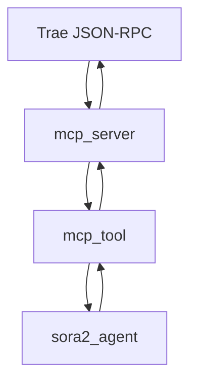
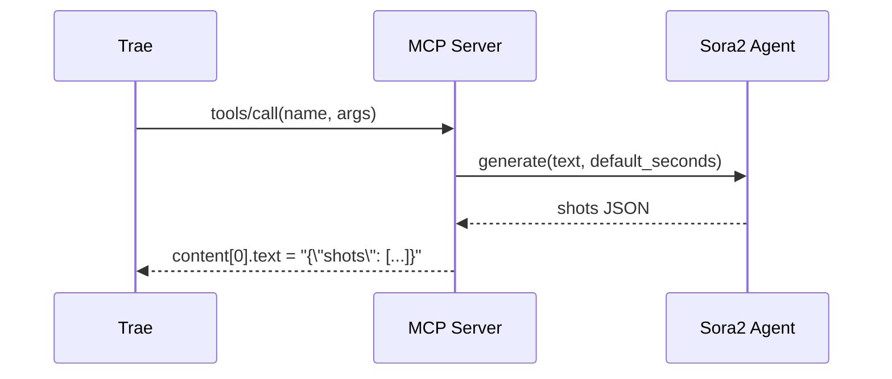

# 开发文档（Sora2 Prompt MCP）

本文面向开发者，介绍架构、扩展点、测试流程与发布策略，并提供可视化时序与流程图。

## 架构概览
- 输入：MCP stdin/stdout JSON-RPC；文本为 UTF-8。
- 输出：`content[0].text` 为 JSON 字符串，结构 `{ shots: Shot[] }`。
- 关键模块：
  - `src/mcp_server.py`：协议处理与工具路由。
  - `src/mcp_tool.py`：工具定义与参数校验。
  - `src/sora2_agent.py`：文本解析（人物、镜头、台词、摄影机与表演）。

## 协议与方法
- `initialize`：协商 `protocolVersion` 与能力。
- `notifications/initialized`：可忽略返回。
- `tools/list`：返回 `name`、`description` 与 `inputSchema`；`nextCursor:""`。
- `tools/call`：按 `name` 执行；本项目工具为 `sora2.agent.generate`。
  - 额外可选参数：`composition_policy` 控制构图偏好（`neutral|mono|mono_or_empty`）。
  - Fallback（多人不可拆分场景）：当 `composition_policy` 生效且文本中存在多人线索但无法拆分为多个单人镜头时，`sora2_agent` 将建议使用极远景或“局部出镜”（如仅拍脚步/手部）的低一致性方案，避免强调多人同框。

## 目录与代码风格
- 目录建议：保持 `src/`、`docs/`、`tests/` 分层，避免交叉依赖。
- 代码风格：
  - 函数尽量短小，避免重复代码。
  - 采用简单设计模式：策略/工厂用于扩展解析器。
  - 输入/输出显式类型与校验，尽量防御性编程。

## 扩展指南
- 新增工具：在 `src/mcp_tool.py` 中注册，定义 `inputSchema` 与路由。
- 新增解析策略：在 `src/sora2_agent.py` 增加策略类，并在入口聚合。
- 错误处理：
  - JSON 解析失败返回 `isError: true` 与 `code: -32700`。
  - 参数错误返回 `isError: true` 与描述信息。
 - 构图偏好：通过在 `generate_sora2_instructions` 贯穿 `composition_policy` 参数实现单人/无人镜头偏好；`guess_cinematography` 在 VO 情况下可输出空环境 B-roll，在多人语境下避免 two-shot/group 文案。
  - 构图 Fallback：多人不可拆分时采用极远景或局部出镜（脚步/手部等），保持镜头低一致性，满足“大家一起”类语义同时不破坏单主体偏好。

## 描述写作规范（Do / Don't）
- Do：将 `description` 写成“中文镜头导语（转换重写，非原文照搬）”，包含景别/主体/动作/情境。例如：
  - 对话：`近景特写张三，他急促喊：快跑！`
  - 旁白：`旁白（VO）：雨夜里，路灯残影在水面摇晃。`
  - 画外音：`画外音（O.S.）——李四：这边！`
- Don't：直接复制原文或仅粘贴台词。例如：
  - `快跑！`（缺少镜头导语与主体）
  - `张三说：“快跑！”`（未转换为镜头描述，仅复述原句）

## 测试流程
- 单元：`src/sora2_agent.py` 的分段解析、台词抽取、摄影机建议。
- 集成：通过 `python -m src.mcp_server` 管道四个请求，校验 `tools/list` 与 `tools/call`。
- 用例：准备 10 条中文文本（叙述、对话、旁白、拟声词、诗词、武打、科幻、都市、古风、儿童），期望输出均含 `shots[*].dialogue.character/line/tone` 与 `api_call.seconds`。

## 发布与标签
- 分支：`main` 保护分支，PR 触发 CI（lint + 简单用例）。
- 语义化版本：`vX.Y.Z`；修复 `nextCursor` 已记为补丁版本。
- 变更日志：在 PR 描述中维护要点，并同步 `docs/MCP.md`。

## 贡献与规范
- Commit：动宾结构，如 `fix: tools/list nextCursor 返回空字符串`。
- PR：描述问题、原因、修复与风险、测试结果。
- 文档：变更同时更新 README 与 MCP 说明。

## 常见坑位
- Windows PowerShell 的中文 JSON 拼接易引号错位导致 `-32700`，使用 `-Raw` + Here-String。
- 严格校验客户端要求 `nextCursor` 字符串，需返回 `""` 而非 `null/省略`。