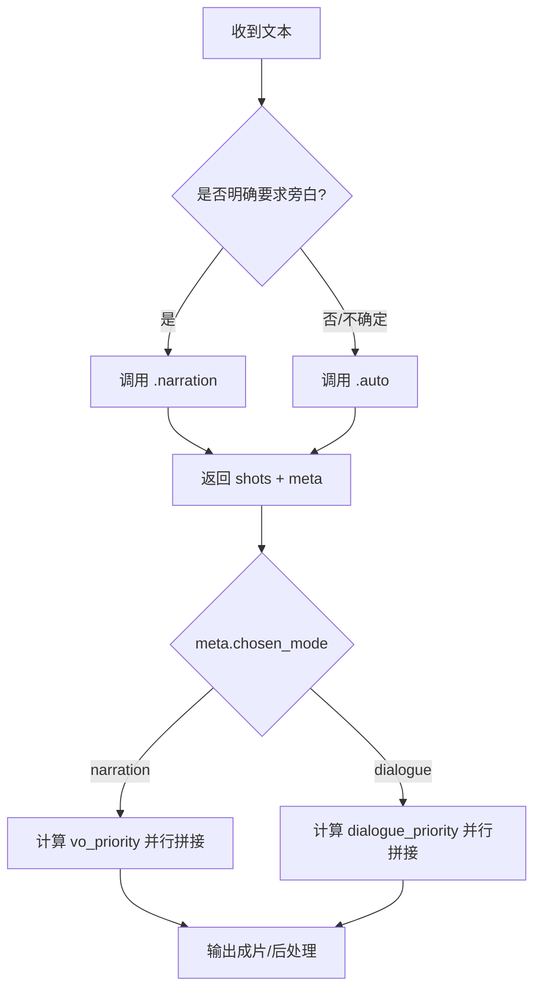
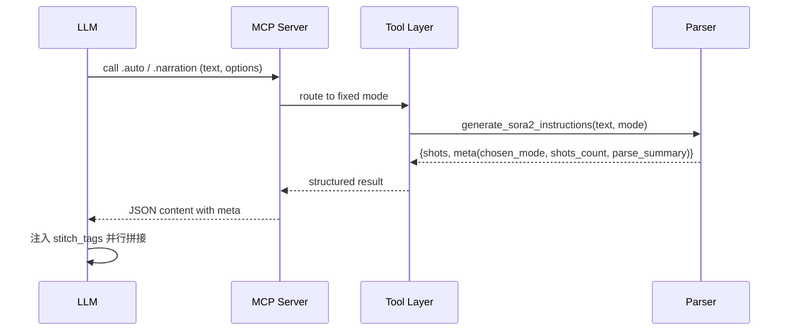

# Sora2 MCP LLM 指令与标签规范

## 指令要点
- 默认调用 `sora2.agent.generate.auto`，由后端自动判定对话/旁白。
- 明确旁白需求时，调用 `sora2.agent.generate.narration` 并传 `narration_limit`。
- 解析返回的 `meta` 字段：`chosen_mode`、`shots_count`、`parse_summary`。

## 拼接标签规范（stitch_tags）
- `audio_type`: `voice_over` | `dialogue`
- `vo_priority`: 0–100（按旁白句占比归一化）
- `dialogue_priority`: 0–100（按对话句占比归一化）
- 计算：
  - `vo_priority = round((narration_count / total_sentences) * 100)`
  - `dialogue_priority = round((dialogue_count / total_sentences) * 100)`
  - `audio_type = (meta.chosen_mode == "narration") ? "voice_over" : "dialogue"`
  - 缺省：当统计缺失或 `total_sentences=0`，两者取 0；`audio_type`照 `chosen_mode`。

## Mermaid 流程图


## Mermaid 时序图


## 示例
- JSON-RPC `.auto`
```json
{"jsonrpc":"2.0","id":"1","method":"tools/call","params":{"name":"sora2.agent.generate.auto","arguments":{"text":"张三说：“快跑！”","default_seconds":"3"}}}
```
- JSON-RPC `.narration`
```json
{"jsonrpc":"2.0","id":"2","method":"tools/call","params":{"name":"sora2.agent.generate.narration","arguments":{"text":"夜色浓重，风声在巷口回旋。","narration_limit":"3"}}}
```

## 10条测试输入与预期
1. 张三说：“快跑！” → `.auto`，`chosen_mode=dialogue`，`dialogue_priority≈100`
2. 远处传来呼喊：“快躲起来！” → `.auto`，`chosen_mode=dialogue`
3. 李四大喊：“这边！” → `.auto`，`chosen_mode=dialogue`
4. 旁白：“他们以为安全。” → `.auto`（含引号），`chosen_mode=dialogue`
5. 张三问：“你看见了吗？” → `.auto`，`chosen_mode=dialogue`
6. 门外有人喊：“开门！” → `.auto`，`chosen_mode=dialogue`
7. 王五说道：“安静。” → `.auto`，`chosen_mode=dialogue`
8. 陈晓低声道：“别动。” → `.auto`，`chosen_mode=dialogue`
9. 画外音：“夜色深沉。” → `.auto`（含引号），`chosen_mode=dialogue`
10. 雨夜里，路灯残影在水面摇晃。 → `.narration`，`chosen_mode=narration`，`vo_priority≈100`