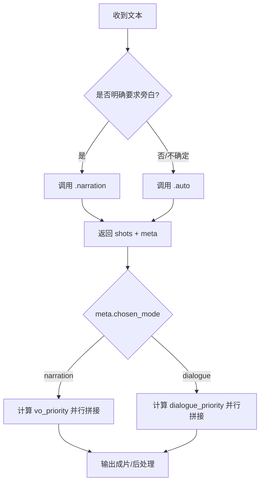
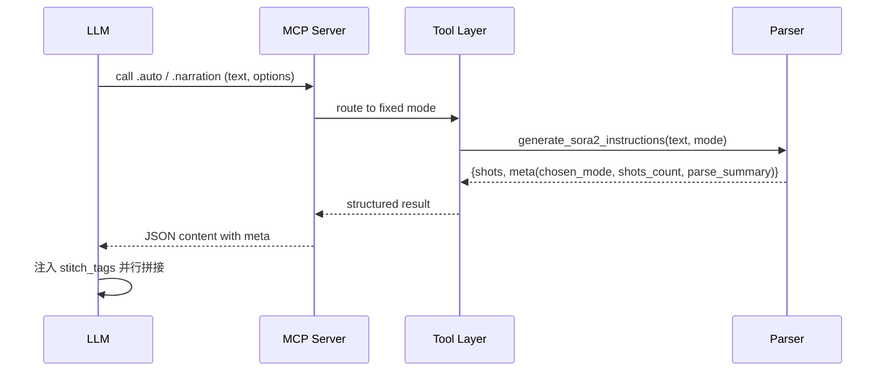

# Sora2 MCP LLM 指令与标签规范

## 指令要点
- 默认调用 `sora2.agent.generate.auto`，由后端自动判定对话/旁白。
- 明确旁白需求时，调用 `sora2.agent.generate.narration` 并传 `narration_limit`。
- 解析返回的 `meta` 字段：`chosen_mode`、`shots_count`、`parse_summary`。

## 拼接标签规范（stitch_tags）
- `audio_type`: `voice_over` | `dialogue`
- `vo_priority`: 0–100（按旁白句占比归一化）
- `dialogue_priority`: 0–100（按对话句占比归一化）
- 计算：
  - `vo_priority = round((narration_count / total_sentences) * 100)`
  - `dialogue_priority = round((dialogue_count / total_sentences) * 100)`
- `audio_type = (meta.chosen_mode == "narration") ? "voice_over" : "dialogue"`
 - 术语区分：旁白=VO（`dialogue.tone` 以 `voice-over` 开头）；画外音=O.S.（`dialogue.tone` 以 `off-screen` 开头），两者不可混用。
  - 缺省：当统计缺失或 `total_sentences=0`，两者取 0；`audio_type`照 `chosen_mode`。

## 描述写作规范（Do / Don't）
- Do：镜头导语化书写，包含景别/主体/动作/情境。例如：
  - 对话：`近景特写张三，他急促喊：快跑！`
  - 旁白：`旁白（VO）：雨夜里，路灯残影在水面摇晃。`
  - 画外音：`画外音（O.S.）——李四：这边！`
- Don't：机械复制原文或仅粘贴台词。例如：
  - `快跑！`（缺少镜头导语与主体）

## 构图偏好与 Fallback（不可拆分多人场景）
- 当 composition_policy=mono 或 mono_or_empty 时：
  - Do：在中文 description 中避免出现“众人/两人/群像”等措辞；尽量使用单主体或空镜表达。
  - Don't：强调 two-shot/group 或暗示多人强同框。
  - Fallback（多人不可拆分）：采用极远景或局部出镜，降低一致性，保留“齐声/一起”等语义。
    - 英文 cinematography 推荐：
      - "Extreme wide establishing; partial framing on lower bodies/feet, subjects distant"
      - "Extreme wide establishing; silhouette framing, subjects distant"
      - "Back view framing; high angle, subjects distant"
      - "Partial framing on hands/shoulders; wide, subjects distant"
      - "Skyline establishing; ambient-only emphasis; subjects implied, not emphasized"
    - 中文 description 推荐：
      - 远景或局部特写脚步，画面内齐声说：{台词}
      - 极远景剪影或背影，不强调人数，画面内齐声说：{台词}
      - 局部特写手部或肩部，画面内齐声说：{台词}
      - 城市天际线远景，声音保留，画面内齐声说：{台词}
      - 环境空镜与物件特写，声音保留，画面内齐声说：{台词}
  - 示例：
    - “他们齐声喊：上！” → description：“极远景剪影或背影，不强调人数，画面内齐声说：上！”；cinematography："Extreme wide establishing; silhouette framing, subjects distant"
    - “同学们围在一起说：稳住！” → description：“局部特写手部或肩部，画面内齐声说：稳住！”；cinematography："Back view framing; high angle, subjects distant"
  - `张三说：“快跑！”`（未转换为镜头描述，仅复述原句）

## 相邻镜头避免重复（Diversity）
- 相邻镜头至少在景别/机位/主体局部/运动中变化一项，避免视觉重复：
  - 英文 cinematography 可追加不同的运动/机位修饰词：`static locked-off` / `slow lateral pan` / `slow push-in` / `subtle handheld` / `tilt up/down`。
  - 中文 description 追加动作提示：`（画面静态锁定）/（镜头缓慢横移）/（镜头缓慢推入）/（轻微手持晃动）/（镜头轻微上/下摇）`。
- 示例：
  - 第1句：“他们齐声喊：上！” → `Extreme wide establishing; silhouette framing, subjects distant`
  - 第2句：“他们齐声喊：现在！” → `Extreme wide establishing; silhouette framing, subjects distant; slow lateral pan`

## Mermaid 流程图


## Mermaid 时序图


## 示例
- JSON-RPC `.auto`
```json
{"jsonrpc":"2.0","id":"1","method":"tools/call","params":{"name":"sora2.agent.generate.auto","arguments":{"text":"张三说：“快跑！”","default_seconds":"3"}}}
```
- JSON-RPC `.narration`
```json
{"jsonrpc":"2.0","id":"2","method":"tools/call","params":{"name":"sora2.agent.generate.narration","arguments":{"text":"夜色浓重，风声在巷口回旋。","narration_limit":"3"}}}
```

## 10条测试输入与预期
1. 张三说：“快跑！” → `.auto`，`chosen_mode=dialogue`，`dialogue_priority≈100`
2. 远处传来呼喊：“快躲起来！” → `.auto`，`chosen_mode=dialogue`
3. 李四大喊：“这边！” → `.auto`，`chosen_mode=dialogue`
4. 旁白：“他们以为安全。” → `.auto`（含引号），`chosen_mode=dialogue`
5. 张三问：“你看见了吗？” → `.auto`，`chosen_mode=dialogue`
6. 门外有人喊：“开门！” → `.auto`，`chosen_mode=dialogue`
7. 王五说道：“安静。” → `.auto`，`chosen_mode=dialogue`
8. 陈晓低声道：“别动。” → `.auto`，`chosen_mode=dialogue`
9. 画外音：“夜色深沉。” → `.auto`（含引号），`chosen_mode=dialogue`
10. 雨夜里，路灯残影在水面摇晃。 → `.narration`，`chosen_mode=narration`，`vo_priority≈100`