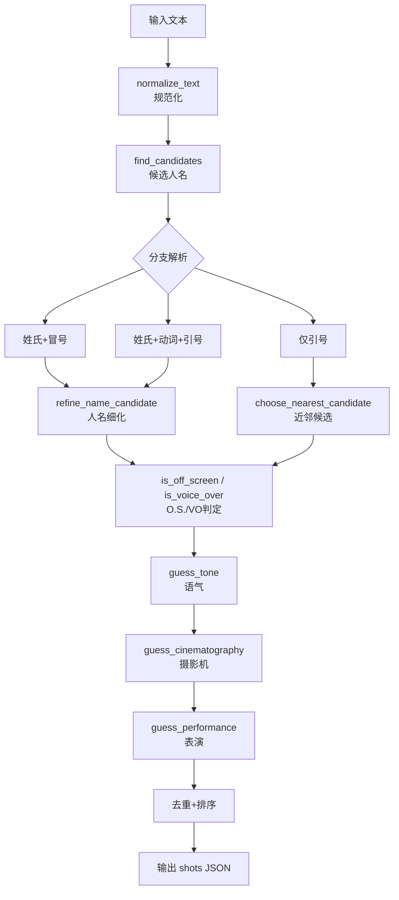
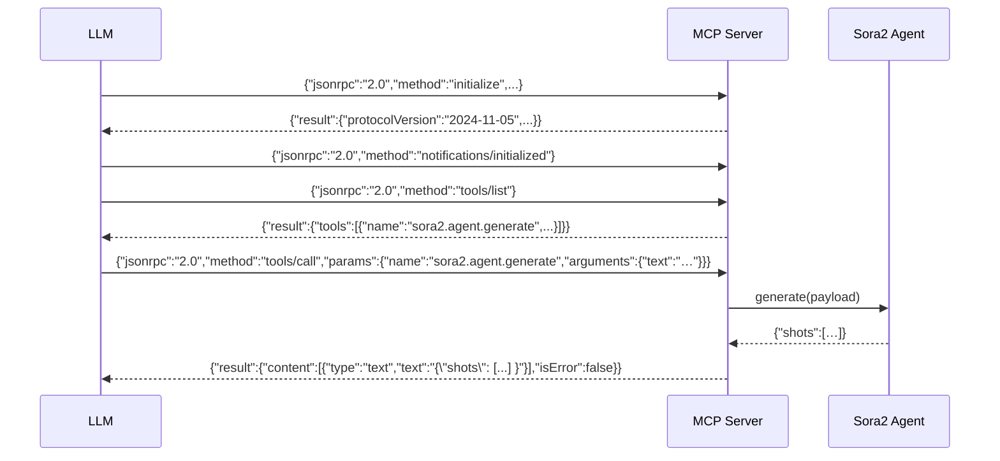

# MCP 工具使用说明（/sora2/agent）

概览：将中文剧本文本解析为结构化的 Sora2 指令（shots JSON），包含角色、人名识别、O.S./VO 判定、摄影机与表演描述、台词与语气。

## 原理（简述）
- 规范化文本，裁剪近邻子句，避免跨句污染。
- 人名候选：优先“姓氏+名字（2-3字）”，再结合上下文候选与清洗后缀。
- 分支解析：
  - 姓氏+冒号模式（如：王强：“…”）
  - 姓氏+动词+引号（如：李四大喊：“…”）
  - 仅引号（无明显人名则回退最近候选或“不明”）
- O.S./VO 判定（严格区分）：仅在当前句近邻子句中识别；`VO` 仅对应“旁白/解说/内心独白”，`O.S.` 对应“画外音/屏外/O.S.” 及远处/门外/屏外等线索，避免将画外音归入旁白。
- 去重与排序：同一句台词仅保留一次，并按原文出现位置排序。



## 调用方式
- 直接函数（Python）：
  - `from src.mcp_tool import generate`
  - `generate({"text": "中文剧本文本", "default_seconds": "4"}) -> {"shots": [...]} `
- MCP 服务器（stdin/stdout JSON，一行一个请求）：
  - 启动：`python -m src.mcp_server`
  - 请求：`{"tool":"/sora2/agent.generate","input":{"text":"..."}}`
  - 列出工具：`{"tool":"list_tools"}`

### 新增通用握手命令（Unix 风格 MCP）

- `initialize`：初始化会话，返回 `session_id`、`server` 信息与 `capabilities`
- `get_manifest`：返回工具清单（`tools`）与错误码说明
- `version`：返回服务器名称与语义版本
- `ping`：健康检查（返回 `{ok: true}`）

返回字段扩展：
- `initialize` 还包含：`defaults`（如 `{"seconds":"4","language":"zh-CN"}`）与 `features`（如 `{"os_keywords":true,"vo_keywords":true}`）。
- `get_manifest.errors` 包含：`NOT_FOUND`、`BAD_JSON`、`BAD_REQUEST`、`SCHEMA_ERROR`、`INVALID_INPUT`。
   - JSON-RPC 错误码映射：
     - `BAD_JSON`: -32700（Parse error）
     - `BAD_REQUEST`: -32600（Invalid Request）
     - `NOT_FOUND`: -32601（Method not found）
     - `SCHEMA_ERROR`: -32602（Invalid params）
     - `INVALID_INPUT`: -32000（应用定义错误）

交互示例（PowerShell，每行一个 JSON 请求）：

```powershell
python -m src.mcp_server
{"tool":"initialize"}
{"tool":"get_manifest"}
{"tool":"version"}
{"tool":"ping"}
{"tool":"list_tools"}
{"tool":"/sora2/agent.generate","input":{"text":"王强压低声音说：\"别出声。\" 远处传来呼喊：\"快躲起来！\" 李四大喊：\"这边！\""}}
```
 
JSON-RPC 2.0（Trae 推荐格式）：

```
{"jsonrpc":"2.0","id":1,"method":"initialize","params":{"protocolVersion":"2024-11-05","capabilities":{"roots":{"listChanged":false}},"clientInfo":{"name":"Trae","version":"1.0.0"}}}
{"jsonrpc":"2.0","method":"notifications/initialized"}
{"jsonrpc":"2.0","id":2,"method":"tools/list","params":{}}
{"jsonrpc":"2.0","id":3,"method":"tools/call","params":{"name":"sora2.agent.generate","arguments":{"text":"示例文本","default_seconds":"4"}}}
```



## 10 条用例与预期结果
1) `王强压低声音说：“别出声。”`
   - 角色：`王强`
   - 语气：`neutral`
2) `远处传来呼喊：“快躲起来！”`
   - 角色：`不明`
   - 语气：`off-screen, urgent`
3) `李四大喊：“这边！”`
   - 角色：`李四`
   - 语气：`urgent, emphatic`
4) `旁白：“他们以为安全。”`
   - 角色：`旁白`
   - 语气：`voice-over, reflective`
5) `张三问：“你看见了吗？”`
   - 角色：`张三`
   - 语气：`neutral`
6) `门外有人喊：“开门！”`
   - 角色：`不明`
   - 语气：`off-screen, urgent`
7) `王五说道：“安静。”`
   - 角色：`王五`
   - 语气：`neutral`
8) `陈晓低声道：“别动。”`
   - 角色：`陈晓`
   - 语气：`rapid, hushed, urgent`
9) `画外音：“夜色深沉。”`
   - 角色：`画外音`
   - 语气：`off-screen, audible`
10) `电话那头传来声音：“喂？”`
    - 角色：`不明`
    - 语气：`off-screen`

## 执行步骤（落地）
- 输入文本（UTF-8，含中文引号/冒号）。
- 调用 `generate(payload)` 或经 MCP 服务器发送 JSON 请求。
- 接收 `shots` 数组，逐镜头包含摄影机、表演、角色、台词与语气。

## 备注
 - 不依赖外网；无需代理配置。
 - 若出现不规范标点（英文引号/冒号），建议先正则替换为中文标点以提升匹配率。
 - 仅保留 Unix 风格 MCP（stdin/stdout NDJSON）；HTTP 端口实现已移除，避免混淆。

## Trae mcpServers 配置（一次性设置）

在 Trae 设置中添加以下配置，避免每次重复询问：

```json
{
  "mcpServers": {
    "sora2": {
      "command": "python",
      "args": ["-m", "src.mcp_server"],
      "env": {
        "PYTHONIOENCODING": "utf-8",
        "PYTHONPATH": "e:\\User\\Documents\\GitHub\\sora prompt"
      }
    }
  }
}
```

说明：
- `python -m src.mcp_server` 以 stdio 方式启动 MCP 服务器。
- `PYTHONIOENCODING` 固定为 `utf-8`，避免编码问题。
- `PYTHONPATH` 指向本仓库根目录，确保 `src.*` 模块可导入。
- Windows 路径包含空格时，Trae 会正确处理；如手工命令行测试，建议使用 JSON-RPC 而非 NDJSON，避免 PowerShell 管道破坏引号。

## Trae 内一键测试请求集（握手→枚举→调用）

在 Trae 的 MCP 请求面板中依次发送以下四条请求：

```
{"jsonrpc":"2.0","id":1,"method":"initialize","params":{"protocolVersion":"2024-11-05","capabilities":{},"clientInfo":{"name":"Trae","version":"1.0"}}}
{"jsonrpc":"2.0","method":"notifications/initialized"}
{"jsonrpc":"2.0","id":2,"method":"tools/list"}
{"jsonrpc":"2.0","id":3,"method":"tools/call","params":{"name":"sora2.agent.generate","arguments":{"text":"李四大喊：“这边！”","default_seconds":"4","narration_limit":"3"}}}
```

预期返回摘要：
- `initialize`：`result.protocolVersion="2024-11-05"`，含 `serverInfo/capabilities.tools`。
- `tools/list`：`result.tools[0].name="sora2.agent.generate"`，`inputSchema.required=["text"]`；`properties` 包含可选 `default_seconds` 与 `narration_limit`（字符串）。
 - `tools/list`：包含 `sora2.agent.generate`（可传 `mode=auto|narration`）、并列工具 `sora2.agent.generate.auto` 与 `sora2.agent.generate.narration`。三者的 `inputSchema.required=["text"]`；`properties` 均支持可选 `default_seconds`，其中旁白相关支持 `narration_limit`。
 - `tools/call` 返回：`{"shots": [...], "meta": {"chosen_mode": "narration|dialogue", "shots_count": N}}`
- `tools/call`：`result.content[0].type="text"`，`text` 字段为 JSON 字符串，包含 `"shots": [...]` 且 `dialogue.line="这边！"`。

备注（兼容 Trae 校验）：
- 无分页时返回 `nextCursor: ""`（空字符串），避免 `invalid_type: expected string, received null` 报错。

## 示例：处理 tests/测试文稿.md 并保存结果

- 一键（PowerShell）通过 MCP 服务器：

```powershell
$t = Get-Content "tests/测试文稿.md" -Raw
Write-Output (@"{""jsonrpc"":""2.0"",""id"":3,""method"":""tools/call"",""params"":{""name"":""sora2.agent.generate"",""arguments"":{""text"":""$t"",""default_seconds"":""4"",""narration_limit"":""3""}}}@") | python -m src.mcp_server > tests/shots_测试文稿.json

### 强制旁白模式（单口讲故事）
- 使用 MCP：
```
{"jsonrpc":"2.0","id":3,"method":"tools/call","params":{"name":"sora2.agent.generate","arguments":{"text":"$t","default_seconds":"4","narration_limit":"3","mode":"narration"}}}
```
- 使用 CLI：
```
python -m src.sora2_agent --text_file tests/测试文稿.md --seconds 4 --narration_limit 3 --mode narration > tests/shots_测试文稿.json
```
```

- 直接 CLI（不经 MCP）：

```powershell
python -m src.sora2_agent --text_file tests/测试文稿.md --seconds 4 > tests/shots_测试文稿.json

### 旁白模式说明
- 当文本中无对话结构（如中文引号或“角色: 引号台词”）时，自动进入旁白 VO 模式。
- 旁白将按句切分，默认最多生成 3 个镜头（可通过 `narration_limit` 控制）。
```

- 预期：生成的 `tests/shots_测试文稿.json` 含 `shots` 数组；若为空请检查输入文本编码为 UTF-8。