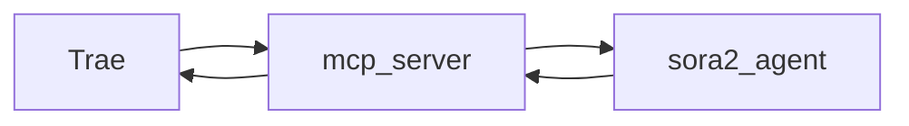
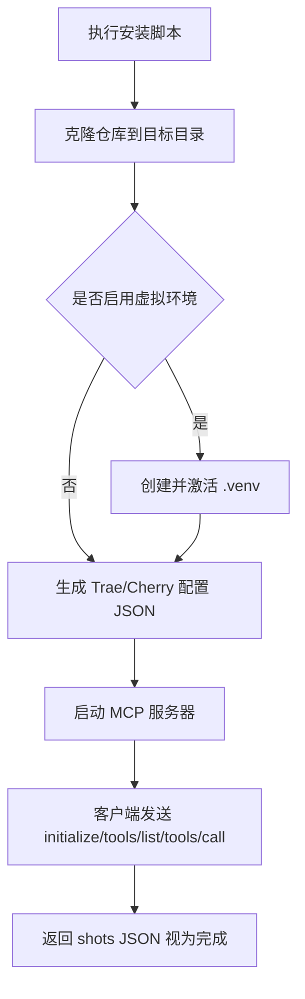

# 快速上手（中文版）

5 分钟完成安装与验证，适合第一次使用本项目的同学。

## 1. 环境准备
- 安装 Python 3.11+。
- Windows 11 建议设置环境变量：`PYTHONIOENCODING=utf-8`。

## 2. 启动 MCP 服务器（Trae）
在 Trae 的设置中添加：
```json
{
  "mcpServers": {
    "sora2": {
      "command": "python",
      "args": ["-m", "src.mcp_server"],
      "env": {
        "PYTHONIOENCODING": "utf-8"
      }
    }
  }
}
```

## 3. 查看工具列表
在 MCP 面板发送：
```
{"jsonrpc":"2.0","id":2,"method":"tools/list"}
```
应返回包含 `sora2.agent.generate` 的工具列表，且 `nextCursor` 为 `""`。

## 4. 处理文本
示例：将 `tests/测试文稿.md` 转换为 shots JSON。
```
{"jsonrpc":"2.0","id":3,"method":"tools/call","params":{"name":"sora2.agent.generate","arguments":{"text":"示例中文文本","default_seconds":"4"}}}
```
结果在 `result.content[0].text`，是包含 `shots` 的 JSON 字符串。

## 5. 常见问题
- 若报 `-32700`（JSON 解析失败），检查引号与中文转义，或使用 Trae 面板直接发送而非 PowerShell 拼接。
- 若客户端严格校验 `nextCursor` 类型，请确认其为空字符串 `""`。


## 描述写作规范（Do / Don't）
- Do：将 `description` 写成“中文镜头导语（转换重写，非原文照搬）”，包含景别/主体/动作/情境。例如：
  - 对话：`近景特写张三，他急促喊：快跑！`
  - 旁白：`旁白（VO）：雨夜里，路灯残影在水面摇晃。`
  - 画外音：`画外音（O.S.）——李四：这边！`
- Don't：直接复制原文或仅粘贴台词。例如：
  - `快跑！`（缺少镜头导语与主体）
  - `张三说：“快跑！”`（未转换为镜头描述，仅复述原句）
## 构图偏好快速指南
当需要偏好单主体/无人镜头时，将 `composition_policy` 设为 `mono` 或 `mono_or_empty`。

不可拆分多人场景的 Fallback：
- 英文 cinematography：
  - `Extreme wide establishing; partial framing on lower bodies/feet, subjects distant`
  - `Extreme wide establishing; silhouette framing, subjects distant`
  - `Back view framing; high angle, subjects distant`
  - `Partial framing on hands/shoulders; wide, subjects distant`
  - `Skyline establishing; ambient-only emphasis; subjects implied, not emphasized`
- 中文 description：
  - 远景或局部特写脚步，画面内齐声说：{台词}
  - 极远景剪影或背影，不强调人数，画面内齐声说：{台词}
  - 局部特写手部或肩部，画面内齐声说：{台词}
  - 城市天际线远景，声音保留，画面内齐声说：{台词}
  - 环境空镜与物件特写，声音保留，画面内齐声说：{台词}

注意：中文描述避免出现“众人/两人/群像”等词；英文 cinematography 避免 `group`/`two-shot` 等词。

## 相邻镜头避免重复（Diversity）
- 快速原则：相邻镜头至少在景别/机位/主体局部/运动之一发生变化，避免视觉重复。
- 英文 cinematography 可在后一个镜头追加不同修饰：`static locked-off` / `slow lateral pan` / `slow push-in` / `subtle handheld` / `tilt up/down`。
- 中文 description 可追加提示：`（画面静态锁定）/（镜头缓慢横移）/（镜头缓慢推入）/（轻微手持晃动）/（镜头轻微上/下摇）`。
## 6. 自动安装脚本（Windows 10 / Cherry Studio / Trae）
本仓库提供一键安装脚本，自动完成：克隆仓库、生成 MCP 配置片段（Trae/Cherry）。

命令示例（PowerShell）：
```
.\n+scripts\install_sora2_mcp.ps1 -TargetDir "D:\Dev\sor2-prompt-mcp" -Branch "feat/composition-policy" -Proxy "http://127.0.0.1:7890" -GenerateConfig both
```

参数说明：
- `-TargetDir`：安装目录（默认 `~\Documents\sor2-prompt-mcp`）
- `-Branch`：分支（默认 `feat/composition-policy`，也可设置为 `main`）
- `-Proxy`：可选，Clash 本地代理如 `http://127.0.0.1:7890`
- `-UseVenv`：可选，创建并激活虚拟环境
- `-GenerateConfig`：`trae|cherry|both`，生成相应的配置片段
- `-MCPName`：MCP 名称（默认 `sora2`）

生成结果：
- `scripts\trae_mcp_sora2.json`：可粘贴到 Trae 设置中的 `mcpServers`。
- `scripts\cherry_mcp_sora2.json`：可粘贴到 Cherry Studio 的 MCP 服务器配置界面（命令、参数、cwd、env）。

快速验证：
- 在安装目录运行：`python -m src.mcp_server`
- 在客户端发送 JSON-RPC：`initialize`、`tools/list`、`tools/call`


## 7. 仅生成本机配置（TXT）（推荐简化）
如果你已经手动克隆了仓库，并且只需要生成本机可用的 MCP 配置片段（不做克隆与环境准备），使用：

```
scripts\generate_mcp_config.ps1 -GenerateConfig both -MCPName "sora2" -OutputFile "mcp_config_sora2.txt"
```

说明：
- 在仓库根目录执行此脚本；脚本会在 `scripts` 同目录输出 `mcp_config_sora2.txt`。
- TXT 文件内包含两段 JSON：Trae 的 `mcpServers` 配置与 Cherry 的 MCP JSON，直接复制到 IDE 设置即可。
- 默认输出 UTF-8，且脚本仅使用英文提示，避免 Win10 控制台乱码。