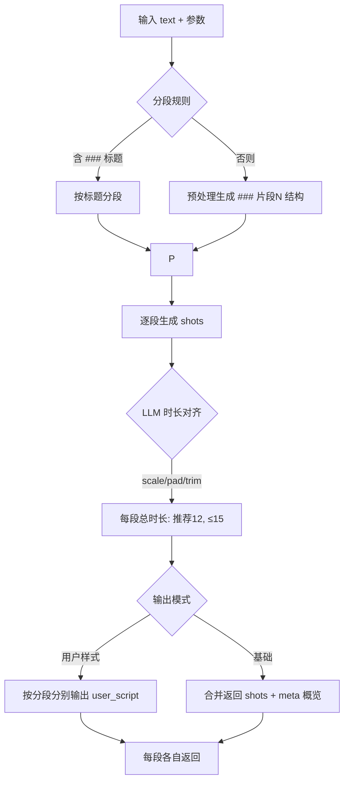

# Sora2 指令生成 · 智能体配置（无 MCP 版本）

## 目标
- 在不依赖 MCP 工具的情况下，完成“剧本文本 → 镜头 JSON”的全流程。
 - 统一分段规则（仅识别 `### 标题`；若无则先转换为该结构）、时长策略（默认 12s，上限 15s）、字段映射（用户示例样式）。
- 输出两类结构：基础 shots JSON 与用户样式 JSON（`shot_type`、`frame_content` 等）。

## 能力概览
- 文本分段：仅识别 `### 标题`；若用户输入没有这种结构，必须先处理成这种结构（生成标准化 Markdown，保留 `###`）。
- 模式识别：自动判定旁白/对话；支持强制旁白（narration）。
- 镜头生成：根据 LLM 提示词模板（prompts/sora2_llm_prompt.md）生成 `shots`。
- 时长对齐：分段内按策略 `scale/pad/trim` 对齐总时长至目标，默认 12s，最多 15s。
- 字段映射：将内部字段映射到用户示例样式（`shot_type`、`frame_content`、`camera_movement`、`sound_effect`、`character`）。
 - 结构化输出：
   - 基础模式：返回 `shots` 与 `meta`（含每分段 `total_duration`）。
   - 用户样式模式（强制按分段分别输出）：为每个分段单独输出一个 `user_script`，禁止将所有分段的镜头合并在一个 `user_script.shots_list` 中；聚合仅允许用于概览 `meta_overview`（可选）。
- 原始文稿模式：当输入为“原始文稿”时，必须先输出分段后的 Markdown 预览（保留 `###`），随后按“每一个分段”为单位，分别生成多段且一一对应的 Sora2 指令，禁止对整篇原稿一次性生成单段指令。

## 输入/输出（I/O Schema）
- 输入参数（对象）：
  - `text`：中文剧本文本（必填）
  - `default_seconds`：每镜头默认时长（字符串，默认 `3`）
  - `narration_limit`：旁白镜头数量上限（默认 `3`）
  - `mode`：解析模式，`auto|narration`（默认 `auto`）
  - `composition_policy`：构图偏好，`neutral|mono|mono_or_empty`（默认 `neutral`）
  - `format`：是否执行分段（默认 `true`）
  - `segment_seconds`：每分段目标总时长（默认 `12`，最大 `15`）
  - `time_fit_strategy`：时长对齐策略，`scale|pad|trim`（默认 `scale`）

- 基础输出（shots 模式）：
  - `shots`: 数组，每项示例：
    - `shot_id`: 字符串，如 `shot_01_role_slug`
    - `description`: 中文镜头导语（重写，不抄原文）
    - `api_call.seconds`: 字符串秒数（整数）
    - `cinematography`: 英文机位与运动（如 `Medium close-up (MCU)`）
    - `performance`: 英文表演描述
    - `dialogue`: `{ character, line, tone }`
  - `meta`: `{ chosen_mode, shots_count, segments: [{title, shots_count, total_duration}], segment_seconds, time_fit_strategy, parse_summary }`

- 用户样式输出（user_script）：
  - `user_script`: `{ shots_list, shots_count, total_duration, meta }`
    - `shots_list` 元素：`{ shot_id, shot_type, duration, frame_content, sound_effect, line, character, camera_movement }`
      - `shot_type`: 依据英文 `cinematography` 映射为中文景别（如：中景、近景、特写、全景）
      - `camera_movement`: 依据英文 `cinematography` 映射为中文运动（固定/平移/缓慢推进/跟拍等）
      - `sound_effect`: 根据 `tone/performance/description` 给出简易提示（如：风声/旁白/低声/急促/无）
      - `character`: 从标准镜头的 `dialogue.character` 直传；值域包括中文人名、`旁白`、`画外音`、`不明`。

## 流程设计


## 关键算法与规则
 - 分段规则（提示词执行）：
  - 仅识别以 `###` 开头的标题，按标题分段。
  - 若文本没有 `###` 标题，则执行预处理：`normalize_to_titles`，自动生成 `### 片段N：标题` 结构，再按标题分段；若文本整体为空也会生成 `### 片段1`。
 - 时长规则（LLM 提示词约束）：
   - 每个“分段”的总时长推荐为 `12s`，且绝不超过 `15s`。
   - 在生成镜头列表时，按 `scale/pad/trim` 的原则调整每个镜头的 `api_call.seconds`（整数、至少 `1s`），使分段总和精确匹配目标或在上限内保守收敛。
   - 该对齐由提示词在输出阶段完成，不依赖任何代码函数。
 - 原始文稿模式（预览与生成约束）：
   - 必须先输出分段 Markdown 预览，段标题格式统一为：`### 片段N：标题`（若无标题则 `### 片段N`）。
   - 随后“按分段分别生成”Sora2 指令：每一分段生成若干镜头与对应指令，严禁将整篇原稿一次性合并生成单段指令。
- 模式识别（detect_mode 替代方案）：
  - 含中文引号“”的句子或常见对话关键词（“说：”、“道：”等）→ `dialogue`
  - 明确“旁白/解说/内心独白/VO”等 → `narration`
  - 否则以简单启发式判定为 `auto` 中的 `dialogue` 或 `narration`。
- 镜头生成（generate_sora2_instructions 替代方案）：
  - 参考 prompts/sora2_llm_prompt.md 中的“中文导语重写、英文 cinematography/ performance/ tone 取值”，并遵守“相邻镜头差异化（景别/机位/运动）”。
  - 旁白（VO）镜头应在 `cinematography` 中包含 `B-roll / montage under narration (VO)`。
- 时长对齐（fit_segment_time 替代方案）：
  - 目标：分段总时长默认 `12` 秒，严格不超过 `15` 秒。
  - `scale`：按比例缩放各镜头秒数到目标，整数四舍五入后迭代校正，确保总和精确匹配。
  - `pad`：当总时长不足目标时，均匀填充到目标。
  - `trim`：当总时长超出目标时，按比例缩减且各镜头不少于 `1` 秒；如本身不足目标，不扩展，仅保证不超过目标。
- 字段映射（user_style_adapter 替代方案）：
  - `description → frame_content`
  - `cinematography → shot_type + camera_movement`（英文短语到中文简表）
  - `dialogue.line → line`
  - `tone/performance/description → sound_effect`
  - `dialogue.character → character`
  - 角色命名约定：中文人名优先；遇到旁白（VO）设为`旁白`；画外音（O.S.）保留原角色或设为`画外音`；无法判断设为`不明`。

## 错误处理与边界
- `text` 为空：返回错误信息或生成空分段占位。
- `segment_seconds` 非法值：回退到默认 `12`。
- 超时/LLM 不稳定：对镜头数量与导语进行保守生成（至少 1 个镜头）。

## 10 条验证用例与预期结果
- 用例原则：验证分段、模式、时长策略与字段映射，不依赖 MCP。
- 结果字段：重点检查 `meta.segments.total_duration` 与 `segment_seconds`、`shots_list` 字段存在与值域合理性，且 `shots_list[*].character` 存在并符合命名约定。

1) narration + scale（按标题分段）
- 输入：
  - `text`: "### 开场\n风声呼啸……\n\n### 转场\n远处火把摇曳……"
  - `format`: true, `mode`: narration, `time_fit_strategy`: scale
- 预期：
  - 分段标题：`["开场","转场"]`
  - 每段 `total_duration = 12`；不超过 `15`
  - `user_script.shots_list` 存在，字段齐全

2) dialogue + scale（无标题：先转换为 `### 片段N` 再分段）
- 输入：`张三说：“快跑！”\n\n李四压低声音说：“这边！”`
- 预期：分段 `片段1/片段2`；每段 `total_duration=12`

3) dialogue + pad（无标题：先转换为 `### 片段N` 再分段）
- 输入同上，`time_fit_strategy=pad`
- 预期：每段总时长填充到 `12`

4) dialogue + trim（无标题：先转换为 `### 片段N` 再分段）
- 输入同上，`time_fit_strategy=trim`
- 预期：若总时长超出，则缩减到 `12`；若不足，则保持不扩展但不超过 `12`

5) narration + scale（单分段）
- 输入：`夜色浓重，风在巷口回旋。`
- 预期：单分段；`total_duration=12`

6) auto 模式（含引号）
- 输入：`门外有人喊：“开门！”`
- 预期：`chosen_mode=dialogue`；至少 1 镜头

7) auto 模式（VO 提示）
- 输入：`旁白：他们以为安全。`
- 预期：`chosen_mode=narration`；镜头中 `cinematography` 含 `B-roll / montage under narration (VO)`

8) composition_policy=mono（无法拆分多人）
- 输入：`他们齐声喊：上！`
- 预期：
  - `cinematography` 优先落在极远景/剪影/背影，避免强调多人同框
  - `shot_type` 映射为“全景/中景”之一，`camera_movement` 不固定但应合理

9) segment_seconds=10 + scale（按标题分段）
- 输入：`### A\n画外传来脚步声。\n\n### B\n他握紧火把。`
- 预期：每分段 `total_duration=10`

10) 字段映射一致性（用户样式）
- 输入：`### A\n他停下脚步，回头张望。\n\n### B\n火把在墙上映出跳动光影。`
- 预期：`shots_list[0]` 包含 `shot_id/shot_type/duration/frame_content/sound_effect/line/camera_movement`

## 使用方式（无 MCP）
- 步骤：
  - 1) 标准化文本（统一引号、清理空白）
  - 2) 分段并输出 Markdown 预览（仅识别 `###`；若无则先转换为 `### 片段N：标题`，保留 `###`）
  - 3) 按“分段”为单元分别生成 Sora2 指令（引用 prompts/sora2_llm_prompt.md 的生成规则与风格）
  - 4) 时长对齐（由提示词执行；`segment_seconds` 推荐 `12`，绝不超过 `15`；策略默认 `scale`）
  - 5) 输出：
    - 基础：合并返回 `shots + meta`（用于概览）。
    - 用户样式：严格按分段分别返回，形成多个 `user_script`（每段一个），不合并 `shots_list`。

- 分段 Markdown 预览示例：
```md
### 片段1：开场
风声呼啸……

### 片段2：转场
远处火把摇曳……
```

- 输出示例（用户样式）：
```json
  {
    "user_script": {
      "shots_list": [
        {
          "shot_id": 1,
          "shot_type": "中景",
          "duration": 3,
          "frame_content": "近景跟拍张三，他急促喊：快跑！",
          "sound_effect": "急促",
          "line": "快跑！",
          "character": "张三",
          "camera_movement": "平移"
        }
      ],
      "shots_count": 1,
      "total_duration": 3,
      "meta": {
        "chosen_mode": "dialogue",
        "segments": [{"title": "片段1", "shots_count": 1, "total_duration": 12}],
        "segment_seconds": 12,
        "time_fit_strategy": "scale"
      }
    }
  }
```

## 时序（Mermaid，暗黑主题可读）


## 提示词约束片段（可嵌入）
- 目标：每个分段的总时长推荐为 `12s`，且严格不超过 `15s`。
- 行为：为该分段内每个镜头设置 `api_call.seconds`（整数，至少 `1s`），并按 `scale/pad/trim` 策略调整，使总和达到目标或不超过上限。
- 约束：若四舍五入产生误差，迭代在秒数>1的镜头上 `±1` 校正，直到满足约束；当策略为 `trim` 且总时长本身不足目标时，不扩展，仅保证 `≤15s`。
- 说明：该约束通过提示词执行，不依赖代码函数；如输入为空或分段失败，生成占位 `### 片段1` 并输出最少 1 个镜头。

## 分段输出结构（严格）
- 原则：每个分段各自输出一组完整的 Sora2 指令（用户样式），禁止把所有分段合并到同一个 `user_script.shots_list`。
- 形态A（推荐，逐段返回多对象）：
  - 片段1 → 返回 `{ "user_script": { ... }, "meta": { segment_seconds, ... } }`
  - 片段2 → 返回 `{ "user_script": { ... }, "meta": { segment_seconds, ... } }`
  - …（每段各自独立返回）
- 形态B（聚合概览，可选，仅供统计）：
  - 返回 `{ "meta_overview": { segments: [{ title, shots_count, total_duration }], segment_seconds, time_fit_strategy } }`
  - 注意：`meta_overview` 不包含合并的 `shots_list`，仅用于统计概览。

### 示例（按分段分别输出）
```json
// 片段1 输出
{
  "user_script": {
    "shots_list": [
      { "shot_id": "seg01_shot01", "shot_type": "中景", "duration": 4, "frame_content": "…", "sound_effect": "旁白/思索", "line": "", "character": "旁白", "camera_movement": "固定" },
      { "shot_id": "seg01_shot02", "shot_type": "特写", "duration": 4, "frame_content": "…", "sound_effect": "无", "line": "", "character": "不明", "camera_movement": "缓慢推进" }
    ],
    "shots_count": 2,
    "total_duration": 12,
    "meta": { "segment_seconds": 12 }
  }
}

// 片段2 输出
{
  "user_script": {
    "shots_list": [
      { "shot_id": "seg02_shot01", "shot_type": "全景", "duration": 6, "frame_content": "…", "sound_effect": "水声/嗖", "line": "", "character": "不明", "camera_movement": "固定" },
      { "shot_id": "seg02_shot02", "shot_type": "大全景", "duration": 6, "frame_content": "…", "sound_effect": "旁白/水泡声", "line": "", "character": "旁白", "camera_movement": "平移" }
    ],
    "shots_count": 2,
    "total_duration": 12,
    "meta": { "segment_seconds": 12 }
  }
}
```

## 备注
- 不添加 `script_info` 到输出结构（按用户要求）。
- 字段映射尽量轻量，避免过度设计；保证可读与稳定。