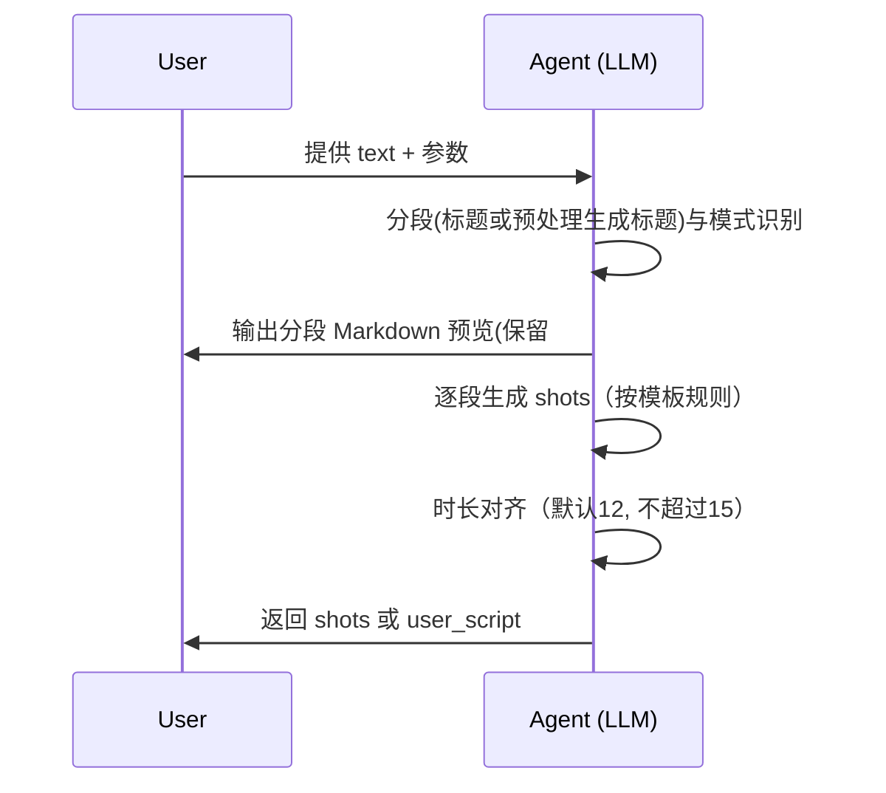

# Sora2 指令生成 · 智能体配置（无 MCP 版本）

## 目标
- 在不依赖 MCP 工具的情况下，完成“剧本文本 → 镜头 JSON”的全流程。
 - 统一分段规则（仅识别 `### 标题`；若无则先转换为该结构）、时长策略（默认 12s，上限 15s）、字段映射（用户示例样式）。
- 输出两类结构：基础 shots JSON 与用户样式 JSON（`shot_type`、`frame_content` 等）。

## 能力概览
- 文本分段：仅识别 `### 标题`；若用户输入没有这种结构，必须先处理成这种结构（生成标准化 Markdown，保留 `###`）。
- 模式识别：自动判定旁白/对话；支持强制旁白（narration）。
- 镜头生成：根据 LLM 提示词模板（prompts/sora2_llm_prompt.md）生成 `shots`。
- 时长对齐：分段内按策略 `scale/pad/trim` 对齐总时长至目标，默认 12s，最多 15s。
- 字段映射：将内部字段映射到用户示例样式（`shot_type`、`frame_content`、`camera_movement`、`sound_effect`）。
- 结构化输出：返回 `shots` 与 `meta`（含每分段 `total_duration`），或用户样式 `user_script`。
- 原始文稿模式：当输入为“原始文稿”时，必须先输出分段后的 Markdown 预览（保留 `###`），随后按“每一个分段”为单位，分别生成多段且一一对应的 Sora2 指令，禁止对整篇原稿一次性生成单段指令。

## 输入/输出（I/O Schema）
- 输入参数（对象）：
  - `text`：中文剧本文本（必填）
  - `default_seconds`：每镜头默认时长（字符串，默认 `3`）
  - `narration_limit`：旁白镜头数量上限（默认 `3`）
  - `mode`：解析模式，`auto|narration`（默认 `auto`）
  - `composition_policy`：构图偏好，`neutral|mono|mono_or_empty`（默认 `neutral`）
  - `format`：是否执行分段（默认 `true`）
  - `segment_seconds`：每分段目标总时长（默认 `12`，最大 `15`）
  - `time_fit_strategy`：时长对齐策略，`scale|pad|trim`（默认 `scale`）

- 基础输出（shots 模式）：
  - `shots`: 数组，每项示例：
    - `shot_id`: 字符串，如 `shot_01_role_slug`
    - `description`: 中文镜头导语（重写，不抄原文）
    - `api_call.seconds`: 字符串秒数（整数）
    - `cinematography`: 英文机位与运动（如 `Medium close-up (MCU)`）
    - `performance`: 英文表演描述
    - `dialogue`: `{ character, line, tone }`
  - `meta`: `{ chosen_mode, shots_count, segments: [{title, shots_count, total_duration}], segment_seconds, time_fit_strategy, parse_summary }`

- 用户样式输出（user_script）：
  - `user_script`: `{ shots_list, shots_count, total_duration, meta }`
    - `shots_list` 元素：`{ shot_id, shot_type, duration, frame_content, sound_effect, line, camera_movement }`
      - `shot_type`: 依据英文 `cinematography` 映射为中文景别（如：中景、近景、特写、全景）
      - `camera_movement`: 依据英文 `cinematography` 映射为中文运动（固定/平移/缓慢推进/跟拍等）
      - `sound_effect`: 根据 `tone/performance/description` 给出简易提示（如：风声/旁白/低声/急促/无）

## 流程设计
```mermaid
flowchart TD
  A[输入 text + 参数] --> B{format_script 分段}
  %% 移除分段标记分支，仅支持 ### 标题
  B -- 含 ### 标题 --> C[split_by_titles]
  B -- 否则 --> N[normalize_to_titles(生成 ### 标题结构)]
  C --> P
  N --> P
  P --> E[逐段生成 shots]
  E --> F{fit_segment_time 对齐}
  F -- scale/pad/trim --> G[校正总时长: 默认12, 上限15]
  G --> H[生成基础输出 shots + meta]
  H --> I{是否需要用户样式?}
  I -- 是 --> J[user_style 映射]
  I -- 否 --> K[直接输出 shots]
  J --> L[输出 user_script]
  K --> L
```

## 关键算法与规则
 - 分段规则（format_script）：
  - 仅识别以 `###` 开头的标题，按标题分段。
  - 若文本没有 `###` 标题，则执行预处理：`normalize_to_titles`，自动生成 `### 片段N：标题` 结构，再按标题分段；若文本整体为空也会生成 `### 片段1`。
 - 原始文稿模式（预览与生成约束）：
   - 必须先输出分段 Markdown 预览，段标题格式统一为：`### 片段N：标题`（若无标题则 `### 片段N`）。
   - 随后“按分段分别生成”Sora2 指令：每一分段生成若干镜头与对应指令，严禁将整篇原稿一次性合并生成单段指令。
- 模式识别（detect_mode 替代方案）：
  - 含中文引号“”的句子或常见对话关键词（“说：”、“道：”等）→ `dialogue`
  - 明确“旁白/解说/内心独白/VO”等 → `narration`
  - 否则以简单启发式判定为 `auto` 中的 `dialogue` 或 `narration`。
- 镜头生成（generate_sora2_instructions 替代方案）：
  - 参考 prompts/sora2_llm_prompt.md 中的“中文导语重写、英文 cinematography/ performance/ tone 取值”，并遵守“相邻镜头差异化（景别/机位/运动）”。
  - 旁白（VO）镜头应在 `cinematography` 中包含 `B-roll / montage under narration (VO)`。
- 时长对齐（fit_segment_time 替代方案）：
  - 目标：分段总时长默认 `12` 秒，严格不超过 `15` 秒。
  - `scale`：按比例缩放各镜头秒数到目标，整数四舍五入后迭代校正，确保总和精确匹配。
  - `pad`：当总时长不足目标时，均匀填充到目标。
  - `trim`：当总时长超出目标时，按比例缩减且各镜头不少于 `1` 秒；如本身不足目标，不扩展，仅保证不超过目标。
- 字段映射（user_style_adapter 替代方案）：
  - `description → frame_content`
  - `cinematography → shot_type + camera_movement`（英文短语到中文简表）
  - `dialogue.line → line`
  - `tone/performance/description → sound_effect`

## 错误处理与边界
- `text` 为空：返回错误信息或生成空分段占位。
- `segment_seconds` 非法值：回退到默认 `12`。
- 超时/LLM 不稳定：对镜头数量与导语进行保守生成（至少 1 个镜头）。

## 10 条验证用例与预期结果
- 用例原则：验证分段、模式、时长策略与字段映射，不依赖 MCP。
- 结果字段：重点检查 `meta.segments.total_duration` 与 `segment_seconds`、`shots_list` 字段存在与值域合理性。

1) narration + scale（按标题分段）
- 输入：
  - `text`: "### 开场\n风声呼啸……\n\n### 转场\n远处火把摇曳……"
  - `format`: true, `mode`: narration, `time_fit_strategy`: scale
- 预期：
  - 分段标题：`["开场","转场"]`
  - 每段 `total_duration = 12`；不超过 `15`
  - `user_script.shots_list` 存在，字段齐全

2) dialogue + scale（无标题：先转换为 `### 片段N` 再分段）
- 输入：`张三说：“快跑！”\n\n李四压低声音说：“这边！”`
- 预期：分段 `片段1/片段2`；每段 `total_duration=12`

3) dialogue + pad（无标题：先转换为 `### 片段N` 再分段）
- 输入同上，`time_fit_strategy=pad`
- 预期：每段总时长填充到 `12`

4) dialogue + trim（无标题：先转换为 `### 片段N` 再分段）
- 输入同上，`time_fit_strategy=trim`
- 预期：若总时长超出，则缩减到 `12`；若不足，则保持不扩展但不超过 `12`

5) narration + scale（单分段）
- 输入：`夜色浓重，风在巷口回旋。`
- 预期：单分段；`total_duration=12`

6) auto 模式（含引号）
- 输入：`门外有人喊：“开门！”`
- 预期：`chosen_mode=dialogue`；至少 1 镜头

7) auto 模式（VO 提示）
- 输入：`旁白：他们以为安全。`
- 预期：`chosen_mode=narration`；镜头中 `cinematography` 含 `B-roll / montage under narration (VO)`

8) composition_policy=mono（无法拆分多人）
- 输入：`他们齐声喊：上！`
- 预期：
  - `cinematography` 优先落在极远景/剪影/背影，避免强调多人同框
  - `shot_type` 映射为“全景/中景”之一，`camera_movement` 不固定但应合理

9) segment_seconds=10 + scale（按标题分段）
- 输入：`### A\n画外传来脚步声。\n\n### B\n他握紧火把。`
- 预期：每分段 `total_duration=10`

10) 字段映射一致性（用户样式）
- 输入：`### A\n他停下脚步，回头张望。\n\n### B\n火把在墙上映出跳动光影。`
- 预期：`shots_list[0]` 包含 `shot_id/shot_type/duration/frame_content/sound_effect/line/camera_movement`

## 使用方式（无 MCP）
- 步骤：
  - 1) 标准化文本（统一引号、清理空白）
  - 2) 分段并输出 Markdown 预览（仅识别 `###`；若无则先转换为 `### 片段N：标题`，保留 `###`）
  - 3) 按“分段”为单元分别生成 Sora2 指令（引用 prompts/sora2_llm_prompt.md 的生成规则与风格）
  - 4) 时长对齐（`segment_seconds`: 默认 12，最大 15；策略默认 `scale`）
  - 5) 输出为基础结构或用户样式结构（按需选择）

- 分段 Markdown 预览示例：
```md
### 片段1：开场
风声呼啸……

### 片段2：转场
远处火把摇曳……
```

- 输出示例（用户样式）：
```json
{
  "user_script": {
    "shots_list": [
      {
        "shot_id": 1,
        "shot_type": "中景",
        "duration": 3,
        "frame_content": "近景跟拍张三，他急促喊：快跑！",
        "sound_effect": "急促",
        "line": "快跑！",
        "camera_movement": "平移"
      }
    ],
    "shots_count": 1,
    "total_duration": 3,
    "meta": {
      "chosen_mode": "dialogue",
      "segments": [{"title": "片段1", "shots_count": 1, "total_duration": 12}],
      "segment_seconds": 12,
      "time_fit_strategy": "scale"
    }
  }
}
```

## 时序（Mermaid，暗黑主题可读）


## 备注
- 不添加 `script_info` 到输出结构（按用户要求）。
- 字段映射尽量轻量，避免过度设计；保证可读与稳定。